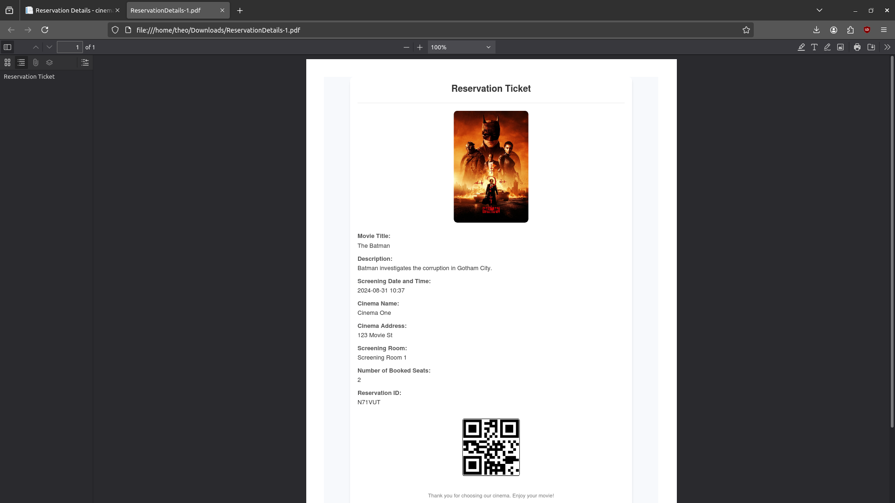

# Web Information Systems (2024) - Cinema Ticket Booking App

## Project Overview

This project is a team assignment for the "Web Information Systems" course, offered in the 8th semester of the 2023-2024 academic year at the University of Piraeus, Department of Informatics. The project focuses on developing a cinema ticket booking web application using ASP.NET and PostgreSQL. The objective is to create a fully functional system that allows users to browse movies, view available showtimes, and book tickets. The system incorporates different user roles with specific permissions and functionalities.

## Course Information
- **Institution:** [University of Piraeus](https://www.unipi.gr/en/)
- **Department:** [Department of Informatics](https://cs.unipi.gr/en/)
- **Course:** Web Information Systems (2023-2024)
- **Semester:** 8th

## Technologies Used

- C# with ASP.NET 8.0
- PostgreSQL
- **NuGet Libraries:**
  - `Microsoft.AspNetCore.Diagnostics.EntityFrameworkCore`
  - `Microsoft.AspNetCore.Identity.EntityFrameworkCore`
  - `Microsoft.AspNetCore.Identity.UI`
  - `Microsoft.EntityFrameworkCore`
  - `DinkToPdf` for generating PDF documents.
  - `QRCoder` for generating QR codes for tickets.

### Application Features

The application has several core features, grouped by the four different types of users:

1. **Customer**:
   - Browse and filter movies.
   - View available showtimes for selected movies.
   - Book tickets for specific showtimes.
   - Manage account information, including profile editing and password changes.
   - Set up two-factor authentication (2FA).
   - View previous bookings and download them in PDF format.

2. **Content Administrator (Company Level)**:
   - Add, edit, and delete available movies.
   - Add, edit, and delete cinema locations.
   - Manage their own account information, including password and 2FA settings.

3. **Content Administrator (Cinema Level)**:
   - Add, edit, and delete showtimes for a specific cinema.
   - Manage announcements related to the cinema.
   - Manage account information, including password and 2FA setup.

4. **Application Administrator**:
   - Full management of users, including creating, editing, and deleting customers, content administrators (both company and cinema level), and other administrators.
   - Manage cinemas, showtimes, and movies across the entire application.
   - Manage account settings, including password changes and 2FA setup.

### Backend Implementation

The application is built using ASP.NET, following the Model-View-Controller (MVC) architecture. PostgreSQL is used for database management, ensuring efficient handling of users, bookings, cinemas, and showtimes. The application includes role-based access control, allowing different functionalities for each user role.

## Database Schema

The database schema designed for this application consists of several entities to manage movies, cinemas, showtimes, bookings, and users. Below is an overview of the main entities and their relationships:

  

## Project Structure

The repository is structured as follows:

```
/cinema-web-app                  # Main directory of the cinema ticket booking app
    /Controllers                 # Contains controller files for handling requests and actions
    /Models                      # Contains data models for the application
    /Views                       # Contains view templates for rendering user interfaces
    /Data                        # Database migration and seed files
    /wwwroot                     # Static files (CSS, JS, images)
    /bin                         # Binary and runtime files
/docs
    /Project-documentation.pdf   # Detailed documentation of the code and algorithm
```

- **`/docs`**: Contains the project description and detailed documentation explaining the code structure, user roles, and the MVC pattern used in the application.

## Usage Instructions

### Setting Up the Application

To set up and run the cinema ticket booking application, follow these steps:

1. **Clone the repository**:
   ```bash
   git clone https://github.com/thkox/cinema-web-app.git
   cd cinema-web-app
   ```

2. **Install required libraries**:
   Ensure you have the necessary NuGet packages installed, including `DinkToPdf` for generating PDF tickets.

3. **Database Setup**:
   - Navigate to the project directory and run the migration commands to set up the PostgreSQL database.
     ```bash
     dotnet ef migrations add InitialCreate
     dotnet ef database update
     ```
   - Optionally, you can use the `SeedData.cs` file to prepopulate the database with demo data.

4. **Run the application**:
   Launch the application using your preferred IDE (e.g., Rider or Visual Studio) or run the following command:
   ```bash
   dotnet run
   ```

5. **Access the application**:
   The web application will be accessible at `http://localhost:5000`.

### Example Output

- **Graphical User Interface**:
  
  

- **PDF Ticket**:
  
  

## Project Documentation

For detailed information about the architecture, code structure, and functionalities, refer to the `Project-documentation.pdf` located in the `/docs` directory. This document covers all aspects of the MVC pattern, the database schema, and role-based access control used in the application.

## Contributors

<table>
  <tr>
    <td align="center"><a href="https://github.com/thkox"><br /><sub><b>Theodoros Koxanoglou</b></sub></a><br /></td>
    <td align="center"><a href="https://github.com/ApostolisSiampanis"><br /><sub><b>Apostolis Siampanis</b></sub></a><br /></td>
  </tr>
</table>

## License

This project is licensed under the MIT License - see the [LICENSE](./LICENSE) file for details.
